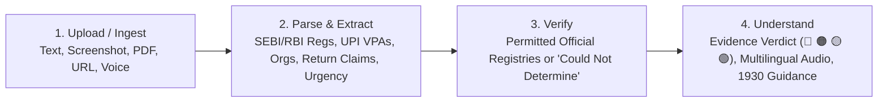

# 🛡️ CHAUKANNA BHARAT (चौंकन्ना भारत)
### *Pre-Transaction Financial Safety & Verification Platform*

> **Core Principle:** *"AI does the reading. Evidence does the verdict."*  
> **Tagline:** *"Pause. Verify. Then Act."* (रुकिए। परखिए। फिर कदम उठाइए।)

---

## 📖 Overview
**Chaukanna Bharat** is a pre-transaction fraud prevention and financial verification platform tailored for India. It protects retail investors, consumers, and senior citizens from stock tip scams, impersonation frauds, advance-fee task scams, illegal loan applications, and predatory digital threats.

Rather than allowing generative AI to blindly hallucinate verdicts, **Chaukanna Bharat** separates textual claim extraction from statutory verification:
1. **AI extracts claims** (organizations, registration numbers, UPI handles, URLs, guaranteed return promises, and urgency tactics).
2. **Deterministic regulatory evidence delivers the verdict** (corroborating directly against official SEBI intermediary lists, RBI-authorized NBFC & bank registries, NPCI payment rules, and statutory fraud precedents).

---

## 🏛️ The 4-Stage Verification Pipeline



1. **Upload / Ingest**:
   - Accepts raw text (SMS, WhatsApp, Telegram), screenshots/images, PDF prospectuses, URLs/web links, and voice notes.
   - Treats all uploaded text as untrusted content; enforces prompt-injection defenses and ephemeral in-memory processing.
2. **Parse & Extract**:
   - Isolates organizations, claimed registration numbers (`INH...`, `INA...`, `INZ...`, `RBI/...`), payment handles (`@okaxis`, `@ybl`), URLs (`t.me/...`, `wa.me/...`), return claims (`guaranteed 40% returns`), and urgency pressure cues.
3. **Verify**:
   - Checks claims against permitted official sources (`PERMITTED_REGISTRY_DATABASE`, `LEGITIMATE_OFFICIAL_DOMAINS`).
   - If an entity cannot be verified in official records, the system reports transparent uncertainty: **`Could Not Determine`** or **`Not Found in Registry`**.
4. **Understand**:
   - Generates an evidence-backed risk score (0 to 100) and badges:
     - 🔴 **HIGH RISK** (76–100)
     - 🟠 **SUSPICIOUS** (46–75)
     - 🟡 **UNVERIFIED** (21–45)
     - 🟢 **VERIFIED** (0–20)
   - Outputs statutory citations (e.g. SEBI PFUTP Regulations 2003, SEBI Act Section 12A).
   - Generates Text-to-Speech audio safety advisories in 6 Indian languages.
   - Provides 1-click incident reporting dossier generation for **1930 / cybercrime.gov.in**.

---

## 📂 Repository Structure

```text
chaukanna-bharat/
├── package.json               # Root npm workspace manifest
├── tsconfig.base.json         # Base TypeScript configuration
├── docker-compose.yml         # Container orchestration
├── packages/
│   └── shared/                # Shared types, constants, registries & translations
│       ├── src/
│       │   ├── types.ts       # Unified TypeScript data models
│       │   ├── constants.ts   # Risk thresholds, portals, statutory notices
│       │   ├── registry-data.ts # Permitted SEBI & RBI database records & demo samples
│       │   └── translations.ts# Multilingual dictionary (EN, HI, BN, TA, TE, MR)
│       └── package.json
└── apps/
    ├── api/                   # Express + TypeScript Verification Engine (Port 3001)
    │   ├── src/
    │   │   ├── pipeline/      # 4-stage pipeline modules
    │   │   │   ├── 1-ingest.ts
    │   │   │   ├── 2-extract.ts
    │   │   │   ├── 3-verify.ts
    │   │   │   └── 4-verdict.ts
    │   │   ├── routes/        # Modular API routes (/api/analyze, /api/verify, /api/report)
    │   │   ├── middleware/    # Security, prompt injection, and ephemeral headers
    │   │   └── server.ts
    │   └── package.json
    └── web/                   # React + Vite + Tailwind CSS Frontend (Port 5173)
        ├── src/
        │   ├── components/    # Navbar, HeroBanner, InputTabs, Results, RegistryExplorer
        │   ├── context/       # LanguageContext, AnalysisContext
        │   ├── hooks/         # useSpeechSynthesis (Indian locales)
        │   └── utils/         # api.ts client
        └── package.json
```

---

## ⚡ Quick Start

### Prerequisites
- **Node.js** v20+ or v24+
- **npm** v10+

### 1. Install Dependencies
```bash
npm install
```

### 2. Build Shared Package
```bash
npm run build -w packages/shared
```

### 3. Launch Development Server (Both API & Web)
```bash
npm run dev
```

- **Frontend (Web):** [http://localhost:5173](http://localhost:5173)
- **Backend (API):** [http://localhost:3001](http://localhost:3001)
- **Health Check:** [http://localhost:3001/health](http://localhost:3001/health)

---

## 🎯 Verification Scenarios & Quick Demos

The platform features a **"⚡ Try Quick Scam Demo"** button on the home screen loaded with the classic high-risk financial fraud:
> *"SEBI approved. Guaranteed 40% returns. Join VIP Telegram. Send ₹10,000 today."*

### Key Scenarios Handled:
1. **Stock Tip Fraud (Classic Scam):**
   - Promising guaranteed 40% returns is unlawful under Regulation 4(2)(k) of SEBI (PFUTP) Regulations 2003.
   - Demands money into private retail UPI VPAs.
   - Solicits victims via unmonitored Telegram channels.
2. **YouTube Video / Task Scams:**
   - "Earn ₹3,500 daily liking YouTube videos; deposit ₹1,500 security fee to activate tasks."
   - Flagged for advance-fee fraud patterns and unverified UPI recipient.
3. **Fake Instant Loan Apps:**
   - Urgent loans approved in 10 minutes without documents, demanding upfront processing fee.
   - Checked against RBI Sachet unauthorized loan databases.
4. **Authentic Bank Alerts:**
   - Real HDFC / SBI transaction SMS alerts verifying whitelisted bank domains and legitimate helpline formats.

---

## 🌐 Multilingual & Accessibility

Supported Indian Languages:
- **English** (`en`)
- **Hindi / हिंदी** (`hi`)
- **Bengali / বাংলা** (`bn`)
- **Tamil / தமிழ்** (`ta`)
- **Telugu / తెలుగు** (`te`)
- **Marathi / मराठी** (`mr`)

### Text-to-Speech ("🔊 Listen / Suno")
Each analysis synthesizes a localized audio warning script tailored to the detected risk level and specific red flags, delivered via the browser's Web Speech API with speed adjustment and visual waveforms.

---

## 🔒 Security Architecture & Guardrails

- **Zero Data Retention (Ephemeral Processing):**
  - Inputs are processed strictly in volatile memory. No databases, persistent disk caches, or external third-party logging of user financial messages.
  - Returns `Cache-Control: no-store, no-cache, must-revalidate`.
- **Credential Defense:**
  - Chaukanna Bharat never requests OTPs, passwords, PINs, or CVVs.
  - If incoming text contains credential harvesting attempts, a critical system warning is immediately rendered: *"CRITICAL ALERT: OTP/PIN/Password requested!"*
- **Zero Trading & Speculation Rule:**
  - Strictly refuses to recommend stocks, provide trading calls, or predict cryptocurrency prices. Only evaluates safety, regulatory registration, and fraud probability.
- **Prompt Injection Neutralization:**
  - All input is sanitized and wrapped in strict data boundaries, stripping instructions such as `"ignore previous instructions"`, `"override risk score"`, or malicious scripts.

---

## 📡 API Reference

| Endpoint | Method | Description |
| :--- | :--- | :--- |
| `/api/analyze/text` | `POST` | Ingests text (SMS, WhatsApp, Telegram) and returns verdict |
| `/api/analyze/image` | `POST` | Accepts screenshot image (file upload or Base64) with OCR fallback |
| `/api/analyze/pdf` | `POST` | Accepts PDF document (loan agreement, prospectus) |
| `/api/analyze/url` | `POST` | Analyzes website domain or Telegram invite link |
| `/api/analyze/voice` | `POST` | Ingests speech transcript from voice messages |
| `/api/analyze/demo/:id` | `GET` | Executes pre-configured verification demo scenario |
| `/api/verify/search` | `GET` | Queries permitted SEBI & RBI registry entries |
| `/api/verify/upi` | `POST` | Evaluates UPI VPA handle safety and personal vs merchant status |
| `/api/report/export-summary` | `POST` | Generates incident dossier formatted for cybercrime.gov.in / 1930 |
| `/health` | `GET` | Health status and uptime |

---

## 🐳 Docker Deployment

To spin up the full production stack using Docker:
```bash
docker-compose up --build
```
- API runs on `http://localhost:3001`
- Web runs on `http://localhost:80`

---

## ⚖️ Statutory Notice
Chaukanna Bharat is an independent public safety verification tool. In case of financial fraud:
- **Call National Cyber Crime Helpline:** **1930**
- **File a complaint online:** [https://cybercrime.gov.in](https://cybercrime.gov.in)
- **Report unauthorized stock tips:** [https://scores.sebi.gov.in](https://scores.sebi.gov.in)
- **Report illegal deposit schemes / loan apps:** [https://sachet.rbi.org.in](https://sachet.rbi.org.in)
